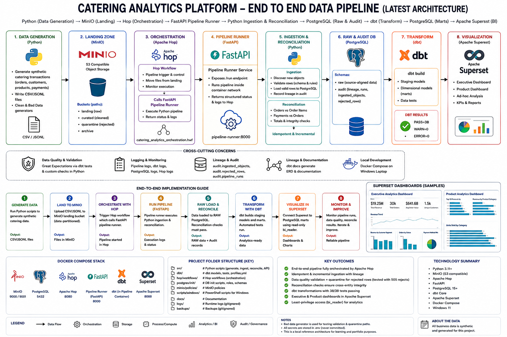
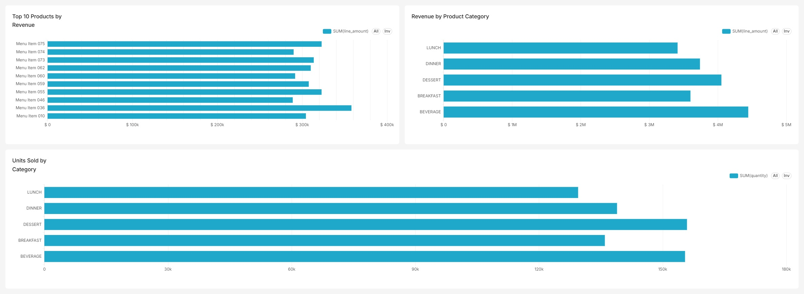
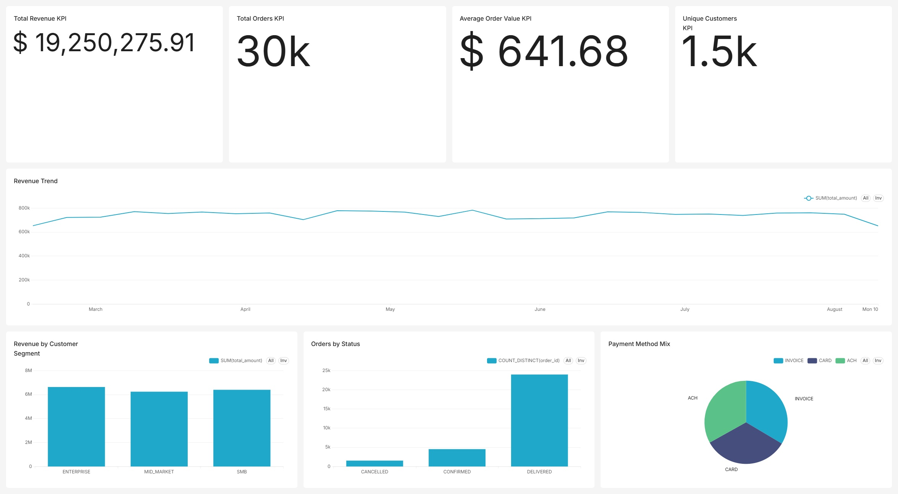

# B2B Catering Analytics Data Platform
A production-style, end-to-end data engineering and analytics platform for a **B2B catering marketplace****, built with:

**Python · MinIO · PostgreSQL · dbt · Apache Hop · FastAPI · Apache Superset · Redis · Docker Compose****

The platform generates synthetic catering transactions, lands immutable source objects in MinIO, validates and incrementally ingests data into PostgreSQL, quarantines invalid records, performs cross-entity reconciliation, builds dimensional analytics marts with dbt, orchestrates execution through Apache Hop, and delivers executive and product analytics through Apache Superset.

> **Project scope:**** This repository is a production-style learning, reference, and portfolio implementation. It demonstrates production engineering patterns while remaining reproducible on a Windows laptop using Docker Desktop.

---

# Architecture Overview


## End-to-End Architecture
```text
                        ┌───────────────────────┐
                        │      Apache Hop       │
                        │ Visual Orchestration  │
                        └───────────┬───────────┘
                                    │
                                    │ HTTP
                                    ▼
                        ┌───────────────────────┐
                        │ FastAPI Pipeline      │
                        │ Runner                │
                        └───────────┬───────────┘
                                    │
                                    ▼
                      ┌─────────────────────────┐
                      │   src.run_pipeline      │
                      │ End-to-End Execution    │
                      └───────────┬─────────────┘
                                  │
                                  ▼
                    ┌─────────────────────────┐
                    │ Python Source Generator │
                    └───────────┬─────────────┘
                                │
                                │ CSV / JSONL
                                ▼
                    ┌─────────────────────────┐
                    │         MinIO           │
                    │                         │
                    │ landing                 │
                    │ curated                 │
                    │ quarantine              │
                    └───────────┬─────────────┘
                                │
                                ▼
                  ┌──────────────────────────────┐
                  │ Python Validation / Ingestion│
                  └──────────────┬───────────────┘
                                 │
                    ┌────────────┴────────────┐
                    │                         │
                    ▼                         ▼
            ┌───────────────┐        ┌────────────────┐
            │ PostgreSQL RAW│        │ Invalid Records │
            │ + Audit       │        │ + Quarantine    │
            └───────┬───────┘        └────────────────┘
                    │
                    ▼
              ┌───────────────┐
              │Reconciliation │
              └───────┬───────┘
                      │
                      ▼
                  ┌───────┐
                  │  dbt  │
                  └───┬───┘
                      │
             ┌────────┴─────────┐
             │                  │
             ▼                  ▼
          staging              marts
                                 │
                                 ▼
                       ┌──────────────────┐
                       │ Apache Superset  │
                       └────────┬─────────┘
                                │
                      ┌─────────┴─────────┐
                      ▼                   ▼
              Executive Analytics   Product Analytics
```

The architecture deliberately separates:

```text
source generation
landing
validation
ingestion
audit
quarantine
reconciliation
transformation
orchestration
business intelligence
```

rather than combining everything into one script.

---

# Technology Stack
| Technology | Responsibility |
|---|---|
| **Python**** | Synthetic source generation, validation, ingestion, reconciliation, pipeline execution |
| **MinIO**** | S3-compatible landing, curated, and quarantine object storage |
| **PostgreSQL**** | RAW warehouse, audit metadata, staging models, dimensional marts |
| **dbt**** | SQL transformation, dimensional modeling, automated data-quality tests |
| **Apache Hop**** | Visual workflow orchestration and success/failure control |
| **FastAPI**** | Internal pipeline-runner API used by Apache Hop |
| **Apache Superset**** | BI semantic layer, virtual datasets, KPIs, and dashboards |
| **Redis**** | Supporting cache service for Superset |
| **Docker Compose**** | Container lifecycle, networking, health checks, persistent volumes |
| **DBeaver**** | PostgreSQL inspection and validation |
| **PowerShell**** | Windows-first operations and local workflow |

---

# Analytics Dashboards
The final analytics layer is implemented in Apache Superset.

Superset connects to PostgreSQL using the restricted:

```text
bi_reader
```

role rather than an administrative account.

Two virtual datasets provide a business-friendly semantic layer over the curated marts:

```text
Catering Order Analytics
Catering Product Analytics
```

---

## Executive Analytics Dashboard


The executive dashboard includes:

- Total Revenue
- Total Orders
- Average Order Value
- Unique Customers
- Weekly Revenue Trend
- Revenue by Customer Segment
- Orders by Status
- Payment Method Mix

The dashboard provides a high-level view of order activity, customer behavior, and payment patterns.

---

## Product Analytics Dashboard


The product analytics dashboard includes:

- Top 10 Products by Revenue
- Revenue by Product Category
- Units Sold by Category

This dashboard is backed by order-item facts joined to product and customer dimensions.

> Dashboard values are generated from synthetic source batches and therefore change as additional batches are processed.

---

# Source Generation Modes
The project intentionally keeps **normal source simulation**** and **failure-path testing**** separate.

This prevents test corruption from accidentally becoming part of normal pipeline runs.

---

## Clean Source Generator
```text
src/generate_and_land.py
```

Used for:

- normal source generation;
- normal manual pipeline execution;
- Apache Hop orchestration;
- regular dashboard growth;
- clean incremental ingestion tests.

It generates valid synthetic:

```text
customers
products
orders
order_items
payments
order.created events
```

Normal clean runs should not intentionally create invalid records.

---

## Controlled Bad-Data Generator
```text
src/generate_and_land_bad_data.py
```

Used only for explicit data-quality testing.

It intentionally injects controlled validation failures such as:

- unsupported customer segments;
- negative product prices;
- invalid order statuses;
- non-positive order-item quantities;
- negative payment amounts.

The bad-data generator is designed to validate:

```text
audit.rejected_rows
MinIO quarantine
row-level validation
cross-entity reconciliation
failure-path observability
```

A controlled test run successfully detected:

```text
505 intentionally invalid records
```

The two generator scripts are intentionally separate so that:

```text
normal business simulation
```

and:

```text
failure-path testing
```

remain clearly isolated.

---

# End-to-End Pipeline
A normal clean pipeline execution performs:

```text
1\. Generate synthetic catering transactions
                |
                v
2\. Write date-partitioned CSV / JSONL objects to MinIO
                |
                v
3\. Discover source objects not previously processed
                |
                v
4\. Validate source records
        +-------+-------+
        |               |
        v               v
      Valid           Invalid
        |               |
        v               +--> audit.rejected_rows
 PostgreSQL RAW          |
        |                +--> MinIO quarantine
        v
5\. Register processed source objects
        |
        v
6\. Run cross-entity reconciliation
        |
        v
7\. Run dbt staging + marts + tests
        |
        v
8\. Serve trusted marts to Apache Superset
```

Apache Hop triggers this same tested pipeline through the internal FastAPI runner.

---

# Synthetic Source Domain
The synthetic generator models a B2B catering transaction domain.

Generated entities:

```text
customers
products
orders
order_items
payments
events
```

Example landing layout:

```text
landing/
├── customers/
│   └── ingest_date=YYYY-MM-DD/
├── products/
│   └── ingest_date=YYYY-MM-DD/
├── orders/
│   └── ingest_date=YYYY-MM-DD/
├── order_items/
│   └── ingest_date=YYYY-MM-DD/
├── payments/
│   └── ingest_date=YYYY-MM-DD/
├── events/
│   └── order_created/
│       └── ingest_date=YYYY-MM-DD/
└── _manifests/
    └── ingest_date=YYYY-MM-DD/
```

Each batch receives a unique:

```text
batch_id
```

which supports lineage from warehouse records back to source generation.

---

# MinIO Storage Design
MinIO contains three primary zones.

| Bucket | Purpose |
|---|---|
| `landing` | Immutable source-style objects |
| `curated` | Reserved for curated object outputs and future extensions |
| `quarantine` | Rejected records preserved for investigation |

Anonymous access is disabled.

Normal pipeline processing uses a dedicated MinIO pipeline account instead of root credentials.

---

# PostgreSQL Data Architecture
The PostgreSQL analytics database is organized into four primary schemas:

```text
analytics
├── raw
├── audit
├── staging
└── marts
```

---

## RAW
The `raw` schema contains accepted source-aligned records.

RAW is intentionally kept close to the source structure and preserves lineage information.

---

## Audit
The `audit` schema contains operational metadata.

Important tables include:

```text
audit.pipeline_runs
audit.ingested_objects
audit.rejected_rows
```

These tables allow the platform to answer:

- Which pipeline run processed the data?
- Which objects have already been processed?
- How many rows were loaded?
- Which rows were rejected?
- Why were rows rejected?
- When did execution start and finish?
- Which source object produced a warehouse record?

---

## Staging
The `staging` schema contains standardized dbt views.

Current staging models include:

```text
stg_customers
stg_products
stg_orders
stg_order_items
stg_payments
```

---

## Marts
The `marts` schema contains trusted analytics-ready structures.

```text
marts.dim_customer
marts.dim_product
marts.dim_payment
marts.dim_date

marts.fact_orders
marts.fact_order_items
```

These models provide the main source for BI consumption.

---

# Incremental Ingestion
The loader processes only previously unseen source objects.

Processed objects are registered in:

```text
audit.ingested_objects
```

This means a new source batch is processed incrementally without replacing prior history.

---

# Idempotent Reruns
If the ingestion step is executed again without new source objects, previously processed object versions are skipped.

A validated rerun produced:

```json
{
  "rows_loaded": 0,
  "objects_processed": 0,
  "rejected_rows": 0
}
```

This demonstrates that rerunning the loader does not duplicate already processed source data.

---

# Data Quality and Quarantine
Validation occurs before accepted rows are written into trusted RAW tables.

Bad records are routed to:

```text
PostgreSQL
└── audit.rejected_rows
```

and:

```text
MinIO
└── quarantine/
```

rather than being silently discarded or allowed into trusted warehouse data.

---

# Why Validation Alone Is Not Enough
The controlled bad-data test exposed an important engineering lesson:

> A row can be individually valid while the overall dataset is still inconsistent.

For example:

```text
order rejected
    |
    +--> related order_items may still be individually valid
    |
    +--> related payment may still be individually valid
```

This can create orphan relationships.

Therefore, the project implements both:

```text
row-level validation
+
cross-entity reconciliation
```

---

# Reconciliation
The reconciliation stage checks integrity across accepted datasets.

Current checks include:

```text
orders_vs_order_items_orphans
payments_vs_orders_orphans
negative_order_totals
order_item_amount_mismatch
```

A healthy clean run requires:

```json
{
  "orders_vs_order_items_orphans": 0,
  "payments_vs_orders_orphans": 0,
  "negative_order_totals": 0,
  "order_item_amount_mismatch": 0
}
```

before downstream analytics processing is considered clean.

---

# dbt Analytics Engineering
dbt transforms accepted RAW data into standardized staging models and dimensional marts.

Current validated build:

```text
5 staging models
6 mart models
27 data tests
38 total dbt operations
```

A validated clean execution completed with:

```text
PASS=38
WARN=0
ERROR=0
SKIP=0
NO-OP=0
REUSED=0
TOTAL=38
```

The dbt test suite includes:

- uniqueness;
- not-null validation;
- accepted-value checks;
- dimension/fact relationship tests;
- non-negative fact amount validation;
- order-item arithmetic validation.

Example relationship:

```text
fact_orders.customer_key
        |
        v
dim_customer.customer_key
```

Example product relationship:

```text
fact_order_items.product_key
        |
        v
dim_product.product_key
```

---

# Apache Hop Orchestration
Apache Hop provides the visual orchestration layer.

The workflow is stored at:

```text
hop/workflows/catering_analytics_orchestration.hwf
```

Workflow behavior:

```text
                 +---- success ----> Success
Start -> Pipeline
                 +---- failure ----> Failure
```

Hop invokes:

```text
http\://pipeline-runner:8000/hop/run
```

inside the Docker network.

The runner then executes:

```text
src.run_pipeline
```

This allows Hop to orchestrate the already-tested pipeline without duplicating ingestion or transformation logic.

---

# FastAPI Pipeline Runner
The internal runner is implemented in:

```text
src/pipeline_runner_api.py
```

Endpoints:

```text
GET  /health
POST /run
GET  /hop/run
```

### `/health`
Used by Docker health checks.

### `/run`
Provides a standard programmatic POST trigger.

### `/hop/run`
Provides a Hop-friendly GET endpoint.

All execution ultimately delegates to:

```text
python -m src.run_pipeline
```

---

# Why Use FastAPI Between Hop and Python?
The FastAPI service creates a narrow orchestration boundary.

Apache Hop does not require:

- Docker socket access;
- host process access;
- knowledge of internal pipeline implementation details.

Hop only needs to call an internal HTTP endpoint.

This is cleaner and safer than allowing the orchestration container to control Docker directly.

---

# Apache Superset Analytics Layer
Superset consumes trusted marts through a restricted PostgreSQL role:

```text
bi_reader
```

Two virtual datasets provide a small semantic layer.

---

## Catering Order Analytics
Combines order facts with customer/payment context.

Supports:

```text
Total Revenue
Total Orders
Average Order Value
Unique Customers
Revenue Trend
Revenue by Customer Segment
Orders by Status
Payment Method Mix
```

---

## Catering Product Analytics
Combines order-item facts with product/customer context.

Supports:

```text
Top 10 Products by Revenue
Revenue by Product Category
Units Sold by Category
```

---

# Validated Project Results
The completed project has demonstrated:

| Capability | Result |
|---|---|
| PostgreSQL | Healthy |
| MinIO | Healthy |
| Redis | Healthy |
| Superset metadata DB | Healthy |
| Apache Superset | Healthy |
| Apache Hop | Running successfully |
| FastAPI runner | Healthy |
| Normal synthetic generation | Validated |
| Incremental ingestion | Validated |
| Idempotent rerun | `0` duplicate objects processed |
| Controlled bad-data generation | Validated |
| Bad-data rejection | `505` rejected records detected |
| MinIO quarantine | Validated |
| Cross-entity reconciliation | Validated |
| dbt | `38/38` operations passing |
| Hop end-to-end orchestration | Successful |
| Read-only BI access | Validated |
| Executive dashboard | Complete |
| Product dashboard | Complete |

Point-in-time dashboard values are intentionally not permanent acceptance criteria because each generated batch increases the synthetic data volume.

---

# Security and Least Privilege
PostgreSQL responsibilities are separated across dedicated roles:

```text
platform_admin
ingest_user
dbt_user
bi_reader
```

### `platform_admin`
Database administration.

### `ingest_user`
Pipeline ingestion.

### `dbt_user`
Transformation workloads.

### `bi_reader`
Read-only analytics consumption.

Apache Superset uses:

```text
bi_reader
```

rather than an administrative account.

MinIO similarly separates administrative access from pipeline processing.

Secrets are supplied through:

```text
.env
```

which is excluded from Git.

The repository includes:

```text
.env.example
```

with placeholder values only.

---

# Docker Compose Stack
The platform is defined in:

```text
compose.yaml
```

Primary services:

```text
postgres
minio
minio-init
pipeline
pipeline-runner
hop-web
superset-meta
redis
superset
```

The manual pipeline utility service uses the Compose:

```text
tools
```

profile.

The always-running:

```text
pipeline-runner
```

provides the internal orchestration API.

Services communicate through:

```text
data_net
```

using Docker service names instead of `localhost`.

---

# Local Service Endpoints
| Service | Address |
|---|---|
| Apache Hop Web | `http\://localhost:8080` |
| Apache Superset | `http\://localhost:8088` |
| MinIO API | `http\://localhost:9000` |
| MinIO Console | `http\://localhost:9001` |
| PostgreSQL / DBeaver | `localhost:5432` |

The FastAPI runner is intentionally internal to the Docker network.

---

# Repository Layout
```text
.
├── compose.yaml
├── .env.example
├── .gitignore
├── README.md
│
├── src/
│   ├── common.py
│   ├── generate_and_land.py
│   ├── generate_and_land_bad_data.py
│   ├── load_minio_to_postgres.py
│   ├── reconcile.py
│   ├── run_pipeline.py
│   └── pipeline_runner_api.py
│
├── dbt/
│   ├── dbt_project.yml
│   ├── profiles.yml
│   ├── models/
│   │   ├── staging/
│   │   └── marts/
│   └── tests/
│
├── postgres/
│   └── init/
│
├── minio/
│   └── policies/
│
├── docker/
│   ├── minio/
│   ├── pipeline/
│   └── superset/
│
├── hop/
│   └── workflows/
│       └── catering_analytics_orchestration.hwf
│
├── diagrams/
│   ├── Catering_Product_Architecture_Diagram.png
│   ├── Dashboard_1.jpg
│   └── Dashboard_2.jpg
│
├── scripts/
│   └── windows/
│
├── docs/
├── logs/          # runtime, gitignored
└── backups/       # local output, gitignored
```

---

# Prerequisites
Reference environment:

- Windows 11
- PowerShell
- Docker Desktop
- Git
- VS Code
- DBeaver — recommended

Docker Desktop must be running before starting the platform.

---

# Complete Deployment Guide

For the complete Windows deployment, validation, operations, controlled bad-data testing, Apache Hop orchestration, dbt execution, Superset setup, and troubleshooting walkthrough, see:

**[Catering Analytics Deployment Guide](docs/CATERING_ANALYTICS_DEPLOYMENT_GUIDE.md)**

The README is the project overview and quick-start reference. The deployment guide is the authoritative step-by-step implementation and operations runbook.

---

# Quick Start
## 1. Clone the repository
```powershell
git clone <repository-url>
cd <repository-folder>
```

---

## 2. Create `.env`
```powershell
Copy-Item .env.example .env
```

Edit:

```text
.env
```

and replace all placeholder passwords and secrets.

> Never commit `.env`.

---

## 3. Validate Compose
```powershell
docker compose config > $null
```

Normal services:

```powershell
docker compose config --services
```

Including tools profile:

```powershell
docker compose --profile tools config --services
```

---

## 4. Build
```powershell
docker compose build
```

---

## 5. Start
```powershell
docker compose up -d
```

Verify:

```powershell
docker compose ps
```

---

# Running the Clean Pipeline
The normal clean pipeline can be executed with:

```powershell
docker compose --profile tools run --rm pipeline
```

This uses the normal clean generator.

---

# Run Individual Pipeline Stages
## Generate Clean Data
```powershell
docker compose --profile tools run --rm pipeline python -m src.generate_and_land
```

---

## Load New MinIO Objects
```powershell
docker compose --profile tools run --rm pipeline python -m src.load_minio_to_postgres
```

---

## Run Reconciliation
```powershell
docker compose --profile tools run --rm pipeline python -m src.reconcile
```

---

## Run dbt
```powershell
docker compose --profile tools run --rm pipeline dbt build --project-dir /app/dbt --profiles-dir /app/dbt
```

---

# Running the Controlled Bad-Data Test
Generate an intentionally invalid test batch:

```powershell
docker compose --profile tools run --rm pipeline python -m src.generate_and_land_bad_data
```

Then run normal ingestion:

```powershell
docker compose --profile tools run --rm pipeline python -m src.load_minio_to_postgres
```

Inspect:

```text
audit.rejected_rows
```

and:

```text
MinIO quarantine
```

The bad-data generator is **not**** used by the normal clean orchestration path.

---

# Run Through Apache Hop
Open:

```text
http\://localhost:8080
```

Workflow:

```text
/project/workflows/catering_analytics_orchestration.hwf
```

Monitor the FastAPI runner:

```powershell
docker compose logs -f pipeline-runner
```

The Hop workflow calls:

```text
http\://pipeline-runner:8000/hop/run
```

and follows explicit success/failure branches.

---

# Validate Pipeline Runs
Recent runs:

```sql
SELECT \*
FROM audit.pipeline_runs
ORDER BY started_at DESC
LIMIT 10;
```

Processed objects:

```sql
SELECT \*
FROM audit.ingested_objects
ORDER BY ingested_at DESC
LIMIT 20;
```

Rejected records:

```sql
SELECT
    entity_name,
    reason,
    COUNT(\*) AS rejected_count
FROM audit.rejected_rows
GROUP BY
    entity_name,
    reason
ORDER BY
    entity_name,
    reason;
```

---

# Operational Safety
Stop containers while preserving persistent data:

```powershell
docker compose down
```

Avoid:

```powershell
docker compose down -v
```

unless a complete persistent-data reset is intentional.

Persistent Docker volumes protect:

- PostgreSQL data;
- MinIO data;
- Superset metadata;
- Superset home;
- Redis data;
- Hop runtime data.

---

# Key Design Decisions
## Why MinIO Before PostgreSQL?
The landing layer creates an immutable source boundary.

Benefits:

- replay;
- lineage;
- source auditing;
- failure investigation;
- separation between data arrival and warehouse ingestion.

---

## Why RAW Before dbt?
RAW preserves accepted source-aligned history.

dbt owns downstream analytical interpretation.

This prevents analytical business logic from being embedded into source ingestion code.

---

## Why Audit Source Objects?
Object-level tracking allows the loader to distinguish:

```text
new object
```

from:

```text
already processed object
```

which enables safe incremental and idempotent processing.

---

## Why Both Validation and Reconciliation?
Validation asks:

> Is this individual record acceptable?

Reconciliation asks:

> Do all accepted records still form a coherent system?

Both controls are required.

---

## Why Separate Clean and Bad-Data Generators?
Normal operation and failure-path testing should not share hidden behavior.

The project therefore keeps:

```text
generate_and_land.py
```

for clean simulation and:

```text
generate_and_land_bad_data.py
```

for explicit failure testing.

This separation makes demonstrations reproducible and prevents accidental contamination of normal pipeline runs.

---

## Why FastAPI Between Hop and Python?
FastAPI provides a narrow orchestration interface.

Hop does not need:

- direct Docker socket access;
- host command execution;
- pipeline implementation details.

It only requires access to an internal HTTP endpoint.

---

## Why a Read-Only BI Role?
Superset should not use:

```text
platform_admin
```

or ingestion credentials.

It connects through:

```text
bi_reader
```

which limits BI access to the permissions actually required.

---

# Production-Readiness Boundary
This repository demonstrates production **engineering patterns****, not production **infrastructure****.

A real production implementation would typically add:

- cloud-managed PostgreSQL;
- managed object storage;
- centralized secrets management;
- TLS;
- service authentication;
- CI/CD;
- Infrastructure as Code;
- centralized logging;
- metrics;
- tracing;
- alerting;
- high availability;
- disaster recovery;
- stronger network segmentation;
- automated retention and archival;
- workload isolation.

A distributed marketplace platform may also evolve toward:

```text
database-per-service
Kafka / MSK
schema registry
Avro event contracts
Kafka Connect / CDC
Snowflake
Temporal
Kubernetes
Terraform
```

Those are deliberate scope boundaries rather than hidden omissions.

---

# Interview Walkthrough
A concise walkthrough:

### 1. Source Simulation
Generate realistic B2B catering transactions and order events.

### 2. Durable Landing
Persist date-partitioned source objects in MinIO.

### 3. Incremental Ingestion
Process only source objects that have not already been loaded.

### 4. Row-Level Quality Gate
Validate records before RAW insertion.

### 5. Failure Preservation
Write rejected records to:

```text
audit.rejected_rows
```

and:

```text
MinIO quarantine
```

### 6. Auditability
Track pipeline runs, processed objects, rejection reasons, and batch lineage.

### 7. Reconciliation
Validate relationships across independently accepted entities.

### 8. Analytics Engineering
Transform source-aligned RAW data into tested dimensional marts using dbt.

### 9. Orchestration
Trigger the complete pipeline through Apache Hop and FastAPI.

### 10. Controlled Consumption
Expose trusted marts to Superset through a read-only database role.

### 11. Business Analytics
Deliver executive and product analytics dashboards.

---

# What Makes This More Than a Basic ETL Demo?
A basic ETL pipeline answers:

> Did the data move?

This project additionally asks:

> Which source object produced it?

> Has this object already been processed?

> Can the pipeline safely rerun?

> What happened to invalid records?

> Can rejected data be investigated?

> Are accepted entities still relationally coherent?

> Did analytical transformations pass automated tests?

> Can the complete workflow be orchestrated?

> Can BI users access trusted data without administrative privileges?

Those controls are what turn a collection of tools into a data platform.

---

# Documentation
Detailed implementation and operational documentation is available under:

```text
docs/
```

Recommended guides:

| Document | Purpose |
|---|---|
| `docs/CATERING_ANALYTICS_DEPLOYMENT_GUIDE.md` | Complete deployment, validation, operations, and troubleshooting runbook |
| `docs/01-architecture.md` | Architecture and responsibilities |
| `docs/02-windows-prerequisites.md` | Windows and Docker setup |
| `docs/03-first-run.md` | First-run procedure |
| `docs/04-data-generation-and-minio.md` | Source generation and MinIO |
| `docs/05-dbeaver.md` | Database inspection |
| `docs/06-dbt.md` | dbt models and tests |
| `docs/07-apache-hop.md` | Hop orchestration |
| `docs/08-superset.md` | BI configuration |
| `docs/09-data-quality-reconciliation.md` | Data quality and reconciliation |
| `docs/10-operations.md` | Operations |
| `docs/11-troubleshooting.md` | Troubleshooting |
| `docs/12-security-production-readiness.md` | Security and production boundary |
| `docs/14-project-walkthrough.md` | Demo / interview narrative |
| `docs/16-dashboard-kpis.md` | KPI definitions |

---

# Key Takeaways
The completed platform combines:

```text
synthetic source generation
+
object storage
+
lineage
+
incremental ingestion
+
idempotency
+
validation
+
quarantine
+
reconciliation
+
dimensional modeling
+
automated testing
+
orchestration
+
least-privilege BI
```

into one reproducible local reference architecture.

The project can explain not only:

```text
what data exists
```

but also:

```text
where it came from
whether it was already processed
whether it was valid
what happened when it failed
whether related entities remain consistent
whether transformations passed their tests
how trusted data reached business users
```

---

# Project Status
**Completed local reference implementation****

Validated:

```text
[✓] Clean synthetic data generation
[✓] Separate controlled bad-data generation
[✓] MinIO landing
[✓] Incremental ingestion
[✓] Idempotent reruns
[✓] PostgreSQL RAW
[✓] Audit lineage
[✓] Rejected-row auditing
[✓] MinIO quarantine
[✓] Cross-entity reconciliation
[✓] dbt staging
[✓] Dimensional marts
[✓] 38/38 dbt operations passing
[✓] Apache Hop orchestration
[✓] FastAPI pipeline runner
[✓] Success/failure workflow branches
[✓] Read-only Superset access
[✓] Executive analytics dashboard
[✓] Product analytics dashboard
```

---

*All business data in this project is synthetic. No real customer, order, payment, or catering marketplace data is required.*
